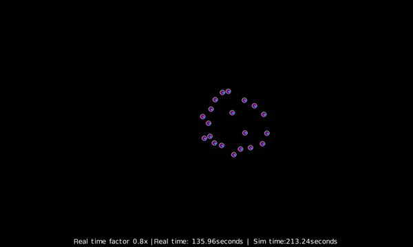

# Swarm Simulation

# Instructions
To set the correct packages on your system, run `setup_linux.sh`
* This script does the following:
    * Updates Linux VM
    * Installs miniconda (skip default miniconda installation)
    * Sets up a conda environment “swarm_sim_env” that contains the following modules:
        * Python2: numpy, typing
        * Python3: pygame, pandas

To run the simulator:
1. Navigate to the `sim_pkg` directory. 
2. Set parameters for the user file in `config.json` and change the code in the `init_pose.py` file if needed.
    * The initialization parameters for each user file are listed at the end of this section.  
3. Run `python3 coachbot_simulation.py -fn <userfile> -c <configfile> -i <initfile>`
    * `<userfile>` is the user's program file (e.g. `firefly.py`)
    * `<configfile>` is the file that stores simulation parameters (e.g. `config.json`)
    * `<initfile>` is the file that initializes robot positions (e.g. `init_pose.py`) 
        * This argument is optional
    * All filename arguments should omit the .py or .json extensions
    * On the first run, there might be connection errors. Usually running `tmux` before running this command fixes the issue.

To run multiple simulations, run `python3 batch_sim.py <num_runs> <userfile> <configfile> <initfile>` 
* `<num_runs>` is the number of simulations to run
* All filename arguments should omit the .py or .json extensions
* The `<initfile>` argument is optional

The available user files are listed below. The position initialization in `init_pose.py` may need to be modified: the code corresponding to each file is written in the comments in `init_pose.py` and labeled. The parameters to set in `config.json` are:

- `firefly.py`
    - USE_INIT_POS: 0
    - NUMBER_OF_ROBOTS: 20
    - COMM_RANGE: 20
    - This file should be run without an `<initfile>` argument
- `lab1.py`
    - USE_INIT_POS: 1
    - NUMBER_OF_ROBOTS: 2
    - COMM_RANGE: 0.7
- `lab2.py`*
    - USE_INIT_POS: 1
    - NUMBER_OF_ROBOTS: 256
    - COMM_RANGE: 0.13
- `lab3.py`*
    - USE_INIT_POS: 1
    - NUMBER_OF_ROBOTS: 100
    - COMM_RANGE: 0.4
- `lab4.py`
    - USE_INIT_POS: 1
    - NUMBER_OF_ROBOTS: 20
    - COMM_RANGE: 20
- `lab4_m.py`
    - USE_INIT_POS: 1
    - NUMBER_OF_ROBOTS: 20
    - COMM_RANGE: 20

`*` - have not been able to run, possibly due to the large number of robots

The parameters to set in the config.json file are: 
1. TIME_ASYNC - 0 to make the robot time synced and 1 to introduce time asynchronous initialization for robots 
2. NUMBER_OF_ROBOTS - Number of robots to launch
3. COMM_RANGE - The range of communication (in meters)
4. PACKET_SUCCESS_PERC - See the success rate of message packets (values in decimal range from 0 to 1)
5. REAL_TIME_FACTOR - Maximum allowable real time factor
6. NUM_OF_MSGS - Maximum number of messages to keep in the buffer
7. MSG_SIZE - Maximum size of each message in buffer
8. WIDTH - width of the arena
9. LENGTH - length of the arena
10. USE_INIT_POS - use the initialization python program to initialize position of the robot
11. SIM_TIME_STEP - Set the simulation time step for each loop cycle
12. USE_VIS - If 1, then visualizer will be used. If 0, then visualizer will not be used and instead all states and the time are logged automatically to sim.log

## Main files to see in the sim_pkg folder

1. simulator.py - The simulator server
2. robot_class.py - Implements the robot API of the real world robots for this simulation
3. visualization.py - uses pygame to visualize the robots
4. user.py - user code written by user to run 
5. coachbot-simulation.py - launches all the processes and programs correctly, using the config.json
6. bootloader.py - launches the user code with the custom coachbot class

## Current structure

## Current Program examples

Firefly algorithm

Flocking algorithm with collision 

## Future improvements

Currently, there is a brute force solution to collision detection. Implementing a faster method of collision detection could speed up the collision detection

## License
[MIT](https://choosealicense.com/licenses/mit/)