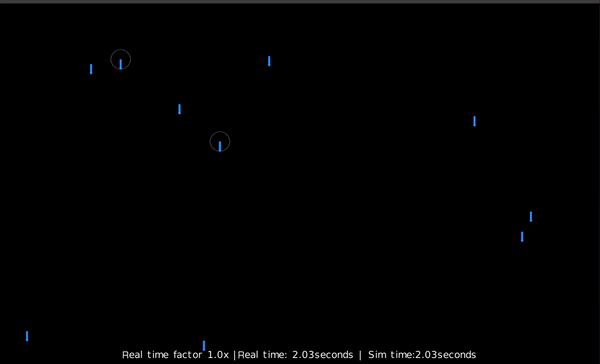

# Swarm Simulation

# Instructions
To run the simulator:
1. Navigate to the `sim_pkg` directory. 
2. Set parameters for the user file in `config.json` if needed.
3. Run `python3 coachbot_simulator.py -u <userfile> -c <configfile> -i <initfile> -n <num_runs>` 
    * `<userfile>` is the user's program file (e.g. `firefly.py`)
    * `<configfile>` is the file that stores simulation parameters (e.g. `config.json`)
    * `<initfile>` is the file that initializes robot positions (e.g. `init_pose.py`) 
        * This argument is optional
        * Accepted file formats: ``.py`` or ``.csv``
    * `<num_runs>` is the number of simulations to run
        * This argument is optional

To generate a histogram of recorded collision counts, run `python3 analyze.py -f <filename>`
* `<filename>` is the name of the log file containing data about collisions

To set up required packages, run `pip install -r requirements.in`

The parameters to set in `config.json` for the example user file, `firefly.py`, are:
- `firefly.py`
    - USE_INIT_POS: 0
    - COMM_RANGE: 20
    - MSG_TYPE: 0
    - This file should be run without an `<initfile>` argument

The parameters to set in the config.json file are: 
1. TIME_ASYNC - 0 to make the robot time synced and 1 to introduce time asynchronous initialization for robots 
2. NUMBER_OF_ROBOTS - Number of robots to launch
3. COMM_RANGE - The range of communication (in meters)
4. PACKET_SUCCESS_PERC - See the success rate of message packets (values in decimal range from 0 to 1)
5. REAL_TIME_FACTOR - Maximum allowable real time factor
6. NUM_OF_MSGS - Maximum number of messages to keep in the buffer
7. MSG_SIZE - Maximum size of each message in buffer
8. MSG_TYPE - Type of message that robots send (0 for string, 1 for bytes)
9. WIDTH - Width of the arena
10. LENGTH - Length of the arena
11. USE_INIT_POS - Use the initialization python program to initialize position of the robot
12. SIM_TIME_STEP - Set the simulation time step for each loop cycle
13. SIM_TIME - Set the total (simulation) time for the simulation to run
14. USE_VIS - If 1, then visualizer will be used. 

## Current structure

## Current Program examples

Firefly algorithm

Flocking algorithm with collision 

## License
[MIT](https://choosealicense.com/licenses/mit/)
